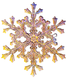

## Welcome to SuiteCases Story Page

### Golden Flower Snow Story 

<b>Image Photo by SuiteCase Friend</b>

_I want to write about my  friend Suitecase's golden  flower snow._

_Suitecase had break from work in christmas time. He decided to go some where that snowed._ 

_He picked New York. He flew to New York. He has designed a car that turns into an Airplane._

_There are three mode that turn the car into different modes._

_One mode is land, the other is flying and the third one is sailing._

_His car has three level. It has elevators.
To use the elevator you need face recognition and passcode._

_First level is a regular mode._ 

_Second level  there is giant car mode that turn the car into a huge one._

_Third level has both airplane and ocean mode._

_Now he went to third level selected airplane mode and flew to New York._ 

_He landed on top of the hotel helipad._ 

_He used a parachute to come to front door of the hotel._ 
_He turned around to look at the snow._

_Instead of regular snow there were golden petals and flowers snow. falling from the sky._

_It was a huge surprise. He rushed inside the hotel and called me to tell you what he  saw._

_Then you told him It is golden flower snow which is unique._ 

_It happens on some special days and he is lucky to see that._ 

_When you pick that golden flower snow and brush  off the snow you get solid golden flower._ 

_So hid that and got a lot of golden flowers. It was like rose and magnolia flower shape._

_He put them in his backpack and went to his flying car and came home. 
He showed me flowers._

### The end. 

### Hope you enjoy this story. Thank You
